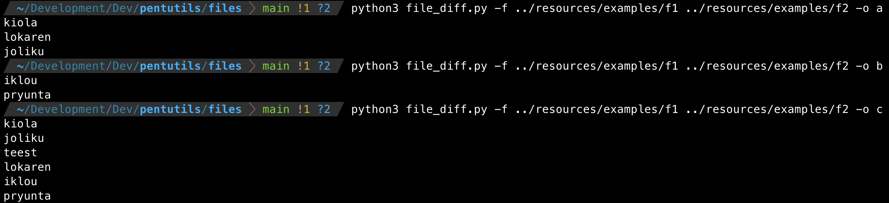

# pentutils
Pentesting util scripts


## Scripts

### File diff

Script: https://raw.githubusercontent.com/xtormin/pentutils/main/scripts/file_diff.py

````
python3 file_diff.py -f f1 f2 -o a          # (f1-f2)
python3 file_diff.py -f f1 f2 -o b          # (f2-f1)
python3 file_diff.py -f f1 f2 -o c          # (f1+f2)
````

````
python3 file_diff.py -f ../resources/examples/f1 ../resources/examples/f2 -o a
````

