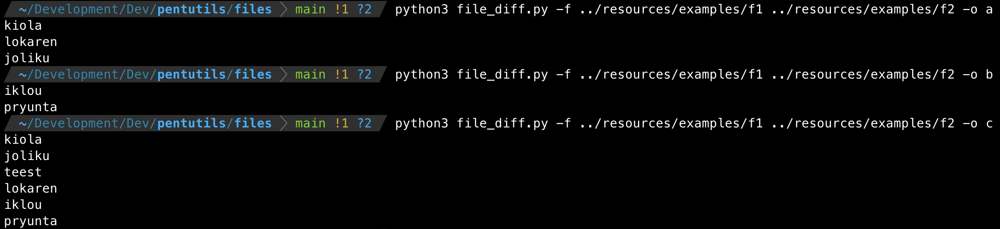
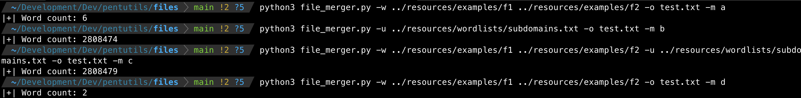

# CyberSnippets

This repository is a compilation of several scripts with different objectives that may occur during penetration testing.

## Setup

```
pip3 install -r setup/requirements.txt
```

## Scripts

The following is a list of the scripts included, instructions and examples of use

- Identification of different elements between files.
- Combinator of lists of elements.

### Identification of different elements between files

- Script: [file_diff.py](scripts%2Ffile_diff.py)

#### Usage

```
python3 file_diff.py -f f1 f2 -o a          # (f1-f2)
python3 file_diff.py -f f1 f2 -o b          # (f2-f1)
python3 file_diff.py -f f1 f2 -o c          # (f1+f2)
```

#### Examples

```
python3 file_diff.py -f ../resources/examples/f1 ../resources/examples/f2 -o a
```



### Combinator of lists of elements

- Script: [file_merger.py](scripts%2Ffile_merger.py)

#### Usage
```
python3 file_merger.py -w <wordlist1> <wordlist2> -o <output file> -m a
python3 file_merger.py -u <file with a list of urls with wordlists> -o <output file> -m b
python3 file_merger.py -w <wordlist1> <wordlist2> -u <file with a list of urls with wordlists> -o <output file> -m c
python3 file_merger.py -w <wordlist1> <wordlist2> -o <output file> -m d
```

#### Examples

```
python3 file_merger.py -w ../resources/examples/f1 ../resources/examples/f2 -o test.txt -m a
python3 file_merger.py -u ../resources/wordlists/subdomains.txt -o test.txt -m b
python3 file_merger.py -w ../resources/examples/f1 ../resources/examples/f2 -u ../resources/wordlists/subdomains.txt -o test.txt -m c
python3 file_merger.py -w ../resources/examples/f1 ../resources/examples/f2 -o test.txt -m d
```


