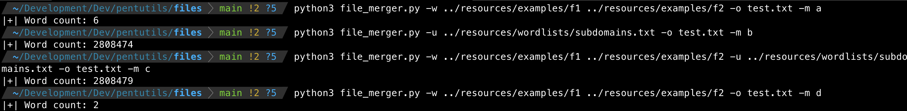

# pentutils
Pentesting util scripts

## Setup

```
pip3 install -r resources/requirements.txt
```

## Scripts

### File diff

Script: https://raw.githubusercontent.com/xtormin/pentutils/main/scripts/file_diff.py

```
python3 file_diff.py -f f1 f2 -o a          # (f1-f2)
python3 file_diff.py -f f1 f2 -o b          # (f2-f1)
python3 file_diff.py -f f1 f2 -o c          # (f1+f2)
```

```
python3 file_diff.py -f ../resources/examples/f1 ../resources/examples/f2 -o a
```


### File merger

Script: https://raw.githubusercontent.com/xtormin/pentutils/main/scripts/file_merger.py

```
python3 file_merger.py -w <wordlist1> <wordlist2> -o <output file> -m a
python3 file_merger.py -u <file with a list of urls with wordlists> -o <output file> -m b
python3 file_merger.py -w <wordlist1> <wordlist2> -u <file with a list of urls with wordlists> -o <output file> -m c
python3 file_merger.py -w <wordlist1> <wordlist2> -o <output file> -m d
```

```
python3 file_merger.py -w ../resources/examples/f1 ../resources/examples/f2 -o test.txt -m a
python3 file_merger.py -u ../resources/wordlists/subdomains.txt -o test.txt -m b
python3 file_merger.py -w ../resources/examples/f1 ../resources/examples/f2 -u ../resources/wordlists/subdomains.txt -o test.txt -m c
python3 file_merger.py -w ../resources/examples/f1 ../resources/examples/f2 -o test.txt -m d
```

